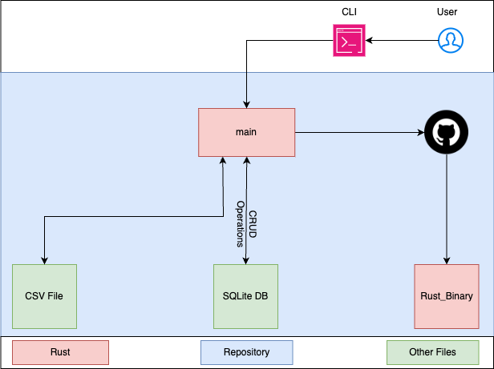
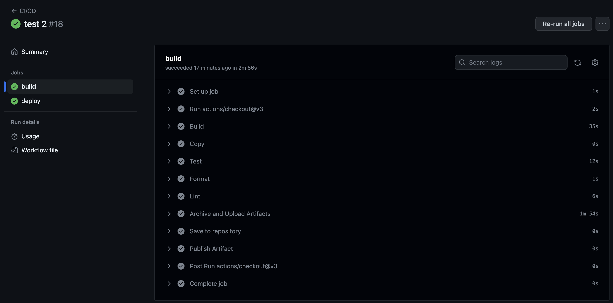

# Rust CLI Binary to perform CRUD Operations in SQLite DB

[](https://github.com/nogibjj/IDS-706_rg361_ind-proj-2/actions/workflows/cicd.yml)

This repositroy contains files to perform CRUD (Create-Read-Update-Delete) operations in a ``SQLite`` Database using ``Rust`` and ``CLI``

Please watch the [Youtube Video](https://youtu.be/957Sv1Bmb1Q) for a brief overview and a demo of code execution and Github Actions.

The base repo has been created from [IDS-706_rg361_week-5](https://github.com/nogibjj/IDS-706_rg361_week-5) and modified as per requirements.

Created on on 29-Oct-2023

## Overview

The repository has the ``main`` rust project which performs CRUD operations on a SQLite Database. The file can be interacted via ``CLI`` (Command Line Interface).

The repository automatically generates an ``optimized Rust binary`` using Github Actions which can be downlaoded.




## Instructions

Create a Codespace on main which will initialize the enviroment with the required packages and settings to execute the codes.

The ``main.rs`` file accepts the commands via ``CLI``, the CLI are of the form:

```console
cargo run XX
```
Where 'XX' is the arguments for the file.

if only cargo run is entered, the file displays the prompts for the inputs it requires.

enter 'exit' to quit the program.

To manually Build the Optimized Rust Binary, execute the following command:
```console
cargo build --release
```

This will generate the executable in the ``/main/target/release`` directory and it will be a file with the name ``main``

## CRUD Operations
The main.rs file creates a SQLite Databse as defined by the user and enters the data from the provided CSV into the Databse as table 'data'.
Once the Database is created the user can interact with the file by entering regular SQL commands which the file then processes and returns the result.

### 1.Create
Sample Input used:
```console
cargo run Master.db '../Data/'blood_pressure.csv'
```

[create](resources/Create.png)

### 2.Read
Sample Input used:
```console
SELECT * FROM data LIMIT 5;
```
[Read](resources/Read.png)

### 3.Update
Sample Input used:
```console
UPDATE data set sex = "Demo" where patient == "1";
```
[Update](resources/Update.png)

### 4.Delete
Sample Input used:
```console
DELETE  FROM data WHERE sex == "Demo";
```
[Delete](resources/Delete.png)


### Github Co-Pilot
The source respository used was made to perform the CRUD opeerations using Python, I used Co-pilot to help convert it to Rust and Copilit helped in the following ways:
1. Creating main.rs. The rust file main.rs has been created with the help of copilot. The week-5 mini project has the python code to perform CRUD operation using sqlite. The copilot helped me in translating it into rust code and performing the required action from CLI
2. The dependencies and packages required for Cargo.toml was added using copilot.
3. It helped me in understanding the usage of cargo commands.
4. It helped with the format for writing test cases in Rust

Sample Interaction:
[Copilot](resources/copilot.png)


## Contents

### 1. Rust_Binary
   A copy of the Optimized Rust Binary which is gerated when "cargo build --release" is executed.

### 2. README.md
   contains the information about the repository and instructions for using it
   

### 3. .github/workflows
   github actions are used to automate the following processes whenever a change is made to the files in the repository:
   - ``Build`` : creates the Optimized Rust Binary File
   - ``Copy`` : copies the binary file to the root directory of the repository as ``Rust_Binary`` for easier access
   - ``test`` : to test the main.rs file
   - ``format`` : uses ``rustfmt`` to format the python files
   - ``lint`` : uses ``clippy`` to lint the python files
   - ``upload and Download`` : Make the Github Action Rust binary atrifact downloadable
   
     
   **Note** -if all the processes run successfully the following output will be visible in github actions:
   
   
### 4. Makefile
   contains the instructions and sequences for the processes used in github actions and .devcontainer for creating the virtual environment
   
### 5. .devcontainer
   contains the ``dockerfile`` and ``devcontainer.json`` files which are used to build and define the setting of the virtual environment (codespaces - python) for running the codes.

### 6. Data
   a sample Dataset of [blood-pressure from Github](https://github.com/Opensourcefordatascience/Data-sets/blob/master/blood_pressure.csv) has been loaded into the resources folder and is used for testing.

### 7. resources 
   contains additonal files which are used in the README


  
